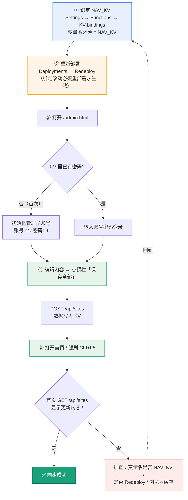

# 部署到 Cloudflare（全栈 Serverless）

本项目已改造为**零服务器**架构：前端仍是静态文件，后端 API 改写为 Cloudflare Pages Functions，
数据存 **KV**、上传图片存 **R2**。后台管理 / AI 一键识别 / 访问统计在线上**全部可用**。

> 本地开发仍可用原来的 `node server.js`（读写本地文件）。线上才走 Functions + KV + R2。

## 一、前置准备

```bash
# 安装并登录 Cloudflare（需有 Cloudflare 账号）
npx wrangler login
```

## 二、创建存储（KV + R2）

```bash
# 1) KV 命名空间（保存导航数据 + 配置）
npx wrangler kv namespace create NAV_KV
#   记下命名空间名称，稍后在后台绑定时选择它

# 2) R2 存储桶（保存上传的图标/图片）
npx wrangler r2 bucket create nav-site-uploads
```

> 绑定名必须分别是 `NAV_KV` 和 `NAV_R2`（代码里写死了）。桶名 `nav-site-uploads` 可改，但需同步改后台绑定。

### ✅ 绑定在哪管理：Cloudflare 后台（可随时增删改）

本项目选择在**Cloudflare 后台**管理 KV / R2 绑定，因此仓库里**不放任何 wrangler 配置文件**。

Cloudflare Pages 的规则（实测 + 官方文档）：

| 仓库里是否有 wrangler 配置文件 | 生产配置来源 | 后台 Settings → Functions 绑定界面 |
| --- | --- | --- |
| **有** `wrangler.toml` / `wrangler.json` / `wrangler.jsonc` | 以该文件为唯一来源 | ❌ **被禁用**，提示"此项目的绑定通过 wrangler.toml 进行管理"，无法增删 |
| **没有**（本项目） | 以 Cloudflare 后台为准 | ✅ **可正常增删改** |

> ⚠️ 实测结论：**仅删除 `pages_build_output_dir` 不足以解除锁定**——只要文件还在，Cloudflare 就会继续
> 显示"managed through wrangler.toml"并禁用界面。必须让仓库里**根本不存在**这些文件。

因此本仓库的做法是：

- **不提交** `wrangler.toml`（已加入 `.gitignore`），只提供模板 `wrangler.toml.example`。
- 模板里的 `[[kv_namespaces]]` / `[[r2_buckets]]` 仅用于**本地开发**（`wrangler pages dev`），不影响线上。
- 本地开发：`cp wrangler.toml.example wrangler.toml` 后 `npx wrangler pages dev`（该文件已被 gitignore，不会误提交）。

⚠️ 两个必须知道的点：

- **绑定改动后必须重新部署才生效**：在后台添加/修改绑定后，需 Deployments → **Redeploy**（或 git push 触发）。
- **`Build output directory` 必须在后台设置**：因为不再由 wrangler.toml 提供，需到
  Settings → Builds & deployments 确认 **Build output directory = `.`**（点号），否则部署后站点无内容。

> 若你更想改用 `wrangler.toml` 管理绑定：把 `wrangler.toml.example` 复制为 `wrangler.toml`、加上
> `pages_build_output_dir = "."`、并从 `.gitignore` 移除该行即可（后台界面会随之禁用）。

## 三、部署（两种方式选其一）

### 方式 A：命令行直接部署（推荐首次验证）

```bash
npm install        # 安装 wrangler（devDependency）
npm run deploy     # = npx wrangler pages deploy .
```

按提示创建 Pages 项目即可。

> 用命令行直传（Direct Upload）前，先 `cp wrangler.toml.example wrangler.toml`，
> 这样 wrangler 能读到绑定并直传；但**正式站点的绑定仍以 Cloudflare 后台为准**（见方式 B 第 4–6 步）。
> 仓库内不含 wrangler 配置时，`wrangler pages deploy` 会提示字段缺失，属正常（不影响 Git 连接部署）。

### 方式 B：连接 GitHub 自动部署（推荐长期）

1. 打开 Cloudflare Dashboard → **Workers & Pages** → **Create** → **Pages** → 连接 Git 仓库 `xiaowen007/nav-site`。
2. 构建设置：**Build command** 填 `node scripts/version.js`，**Build output directory** 填 `.`（点号，表示根目录）。该脚本在每次构建时把 `?v=` 拨为当天日期（防缓存），配合 `.github/workflows/daily-version.yml` 还能每日自动重新部署。
3. 先按「二、创建存储」建好 KV 命名空间和 R2 桶。
4. 直接部署（**无需预先绑定 KV/R2**）。此时网站以**只读种子数据**正常打开，写操作返回 503，属预期。
5. 部署后在**后台添加绑定**：
   - **Settings → Functions → KV namespace bindings → Add**
     变量名 `NAV_KV` → 选择你建的 KV 命名空间
   - **Settings → Functions → R2 buckets bindings → Add**
     变量名 `NAV_R2` → 选择 `nav-site-uploads`
6. **Redeploy 一次**：绑定改动需重新部署才生效（Deployments → 三个点 → Retry deployment，或 Redeploy）。
   部署完成后刷新 `/admin.html`，顶部红色横幅消失，即可正常保存。

> 绑定可在后台随时修改（换命名空间、换桶、改名），**改完记得重新部署**。
> 未绑定时：首页正常浏览（只读种子数据），写操作返回 `503`「存储未绑定：NAV_KV / NAV_R2」，属预期行为。

## 四、首次访问与数据

- 首次打开网站时，Functions 会自动把当前 `data/sites.json`（已打包进种子 `functions/_seed.js`）写入 KV。
- 之后在**后台**（`/admin.html`）的增删改、排序、分类图标、访问统计都会持久化到 KV / R2。
- 后台「生成图片」的分类图标存进 R2，主页通过 `/uploads/xxx.png` 引用。**未绑定 R2 时该地址返回 503**，前端会自动回退显示默认图标 🔗 —— 若图标变成 🔗，先检查 R2 绑定。
- 想重新用本地 `data/sites.json` 覆盖线上数据：在后台点“导出 JSON”拿到最新数据，或清理 KV 键 `sites` 后重新访问即重新播种。

## 设置后台管理员密码

后台 `/admin.html` 需要账号密码才能登录（关闭了开放后台）。密码保护**真正生效的前提是先绑定 `NAV_KV`**——代码里未绑定 KV 时 `requireAuth` 直接放行（开放只读），此时设了密码也不会被校验，只是写操作会返回 503。

### 方式一：首次打开后台初始化（推荐）
1. 浏览器打开 `https://你的域名/admin.html`。
2. 全新部署时 KV 里还没有密码，`GET /api/auth` 返回 `configured:false`，页面自动弹出「初始化管理员账号」界面。
3. 填：管理员账号（≥2 字符，如 `admin`）、密码（≥6 位）、确认密码。
4. 确定 → `POST /api/auth/setup` 把账号密码写入 KV；之后用该账号密码登录，可勾选「记住 30 天」（默认勾选，未勾选则为 12 小时）。

### 方式二：用 Cloudflare 环境变量 / Secret 预设（不用走初始化）
- Cloudflare Dashboard → 项目 **Settings → Variables and Secrets**（或 Functions 变量）添加：
  - `ADMIN_USER`（明文变量，如 `admin`）
  - `ADMIN_PASSWORD`（**设为 Secret 类型**，值填密码）
- 代码中 `env.ADMIN_PASSWORD` 优先级**高于** KV 中存的密码，设好即生效，直接登录即可；可随时轮换 Secret 而不动代码。详见下一节。

### 方式三：登录后在后台改密码
已登录后，后台顶栏「👤 账号」区可改密码（保存到 KV，同样要求 `NAV_KV` 已绑定）。

### 常见坑
- 报 `503 存储未绑定 NAV_KV` → 说明 `env.NAV_KV` 为空。按下面排查：
  1. 到 **Settings → Functions → KV namespace bindings** 确认已添加绑定，且变量名**完全等于** `NAV_KV`（大小写敏感）；
  2. 确认选中的 KV 命名空间在**同一个 Cloudflare 账号**下；
  3. **添加/修改绑定后必须重新部署**才生效（Deployments → Redeploy，或 git push 触发），刷新页面无效。
- 未绑 KV 却设了 env 密码 → 登录界面可能显示，但 `requireAuth` 因无 KV 直接放行，等于没保护；务必先让 KV 生效。
- `env` 密码与初始化密码并存时，env 优先，登录用 env 那套。
- 账号 < 2 字符或密码 < 6 位 → 初始化被拒（400）。

## 五、可选：用密钥保护配置（更安全）

后台“系统设置”里填的 `AI_API_KEY` / `ADMIN_PASSWORD` 会存进 KV。
若想用 Cloudflare Secrets（不落 KV），可：

```bash
npx wrangler secret put ADMIN_PASSWORD
npx wrangler secret put AI_API_KEY
```

环境变量(secrets)优先级高于 KV 中同名配置。

## 六、自定义域名

项目 **Settings → Custom domains** 中添加你的域名，按提示加 DNS 解析即可（免费 SSL）。

## 七、本地预览 Functions

```bash
npm run dev:cf     # npx wrangler pages dev .  （KV/R2 用本地模拟存储）
```

## 八、更新代码后重新部署 & 常见问题排查

### 更新代码后如何触发新部署
- **方式 B（GitHub 连接）**：Cloudflare 在每次 `git push` 到 `main` 后**自动重新构建部署**。流程：本地改完 → `git push` → 在 Dashboard → Deployments 看新构建进度/日志，跑完即上线。
- 代码没变却想重跑：Dashboard → Deployments 点 **Redeploy** 手动触发。
- ⚠️ 部署拉的是**远程仓库最新提交**。本地改了没 `push`，Cloudflare 拉不到。提交前用 `git status` / `git log` 确认本地与远程 tip 一致。

### 部署报错 Failed building Pages Functions（两个真实踩过的坑）
**坑 A：同层文件与目录不能同名**
- 现象：`Failed building Pages Functions` / `generating Pages Functions failed`，日志无明显模块错误。
- 根因：Cloudflare Pages Functions 硬限制——`functions/api/` 下**文件与目录不能同名**。如同时存在 `functions/api/auth.js`（文件）和 `functions/api/auth/`（目录）会直接失败。
- 修复：合并为目录入口，把 `auth.js` 改为 `functions/api/auth/index.js`（保留 `GET /api/auth`），并删除原 `auth.js`。
- 排查：`find functions -name '*.js' | sed 's#/[^/]*$##' | sort -u` 列出所有目录，再 `ls functions/api` 看是否有同名 `.js` 文件。

**坑 B：共享模块 `_lib.js` 的相对 import 路径层级**
- 现象：`Could not resolve "../../../_lib.js"`（或 `../../_lib.js`），esbuild 打包阶段报多个错误。
- 根因：共享逻辑在 `functions/_lib.js`。Functions 内各文件引用它的相对路径，**`../` 的层数必须等于「该文件所在目录 → functions/ 的层数」**，多一级或少一级都找不到：
  - `functions/api/X.js` → `../_lib.js`（api→functions 一级）
  - `functions/api/auth/X.js` → `../../_lib.js`（auth→api→functions 两级）
  - `functions/api/auth/sub/X.js` → `../../../_lib.js`（三级，以此类推）
  - `functions/uploads/X.js` → `../_lib.js`（uploads→functions 一级）
- 注意：`node --check` 只校验语法，**发现不了**路径层级错误；必须用 `node` 实际 `import()` 该文件才能验证。
- 修复：按上表把对应层级的 `../` 数量改对即可。

### 部署成功但后台保存不生效（真实踩过）
- 现象：后台 `/admin.html` 能打开、能改，但点「保存更改」报错或不生效；顶部出现红色横幅
  「⚠️ 存储未绑定 NAV_KV，保存不可用，请在 Cloudflare 后台绑定后重新部署」。
- 横幅出现即表示代码里 `env.NAV_KV` 为空（只读降级模式），按下面顺序排查：
  1. 到 **Settings → Functions → KV namespace bindings** 确认绑定已添加，变量名**完全等于** `NAV_KV`。
     - 若界面显示「此项目的绑定通过 wrangler.toml 进行管理」且无法增删改 → **仓库里仍存在 wrangler 配置文件**。
       实测：只删掉 `pages_build_output_dir` **不够**，必须让仓库中不存在
       `wrangler.toml` / `wrangler.json` / `wrangler.jsonc`（本仓库已移除并加入 `.gitignore`）。
       移除后**重新部署一次**，界面即恢复可编辑。
  2. 确认选中的 KV 命名空间在**同一个 Cloudflare 账号**下。
  3. 确认 **R2 桶 `nav-site-uploads` 真实存在**（R2 → 桶列表），并在
     Settings → Functions → R2 buckets bindings 绑定为 `NAV_R2`（桶不存在会导致部署失败）。
  4. **添加/修改绑定后必须重新部署**才生效：Dashboard → Deployments → **Redeploy**，或 git push 触发。
     刷新页面不会让新绑定生效。
  5. 重新部署成功后刷新 `/admin.html` → 横幅消失即表示 KV 已绑定，可正常保存。
- 只想让首页可浏览、暂不保存：未绑定 KV 时首页本就以只读种子数据正常展示，不影响访问。
- 其他异常先看 Dashboard → Logs / 部署日志。

### 防浏览器缓存：静态资源版本号由构建自动拨号（免手动 + 每日自动）
- `index.html` / `admin.html` 里 `css/style.css`、`js/app.js`、`js/lunar.js`、`js/admin.js` 的 `?v=` 在**部署构建时自动生成**：
  脚本 `scripts/version.js` 在每次构建时把所有 `?v=YYYYMMDD` 替换为**当天日期戳**（如 `20260830`），
  因此每次部署 `?v=` 都会变，浏览器把「不同查询串」视为新文件、**自动拉取新文件**，无需手动 `Ctrl+F5` 强刷。
- **Cloudflare 设置**：后台 **Settings → Builds & deployments** 把 **Build command** 设为
  `node scripts/version.js`（Build output directory 仍为 `.`）。该脚本只改 html 里的 `?v=`，不产生其它产物。
- **每日自动执行（无需手动 push）**：仓库已含 `.github/workflows/daily-version.yml`，
  每天 **UTC 16:00（= 北京 0:00）** 自动跑 `scripts/version.js` 把 `?v=` 拨为当天日期并 push 到 `main`，
  由已绑定的 Cloudflare Pages（git push 触发）完成当日重新部署，使浏览器缓存每天自动失效。
  如需其它时间，改 workflow 里的 `cron: '0 16 * * *'` 即可；也可在 Actions 页面手动 **Run workflow** 立即触发。
- ⚠️ 两层「生效」仍要分清：
  1. **上线生效**：改了代码必须 `git push` → Cloudflare 自动重新部署（或手动 Redeploy），否则线上跑旧文件；
  2. **客户端生效**：`?v=` 因日期变化而不同，浏览器才会放弃缓存去拉新。
  两者都满足，改动能真正被看到；只拨号不 push，或只 push 没触发新构建，都可能「看起来没生效」。
- 本地预览（`node server.js` → http://localhost:8787）：静态服务会忽略 `?v=` 查询串，当前日期值也能正常加载；
  若想本地也刷新版本号，跑一次 `node scripts/version.js`（会把 html 改成当天日期，预览后可用 `git checkout -- index.html admin.html` 还原）。

## 九、速查清单：绑定 → 重部署 → 后台保存 → 主页验证

一键照着走的四步流程（任何一步卡住，顺着箭头回到对应排查点）：



### 文字版清单（复制备用）

1. **绑定**：Dashboard → Workers & Pages → nav-site → **Settings → Functions → KV namespace bindings → Add**
   - Variable name = `NAV_KV`（区分大小写，错一字即失效）
   - 选你的 KV 命名空间（id `3dd2c020…`）
   - 同页加 **R2 buckets bindings**：Variable name = `NAV_R2`，桶 = `nav-site-uploads`
2. **重部署**：**Deployments → Redeploy**（绑定改动必须重部署，只刷新页面无效）
3. **登录/初始化**：开 `https://你的域名/admin.html`
   - 首次 → 初始化管理员账号（账号≥2、密码≥6）
   - 已设过 → 输账号密码登录
4. **保存**：后台增删改 → 点顶栏 **「保存全部」** → 写入 KV
5. **验证**：开首页 `/` → `Ctrl+F5` 强刷 → 应看到更新内容（F12 → Network 看 `GET /api/sites` 返回值）

> 横幅「⚠️ 存储未绑定 NAV_KV」消失 = 绑定生效；仍显示 = 未绑上，回到第 1 步重核变量名。

## 目录说明

```
functions/
  _lib.js            # 共享逻辑（config/数据/AI/工具）
  _seed.js           # KV 为空时的种子数据（来自 data/sites.json，勿手改）
  api/sites.js       # GET 读 / POST 全量保存
  api/save.js        # POST 单条 upsert
  api/recognize.js   # POST AI/启发式识别
  api/upload.js      # POST 上传图片 -> R2
  api/visit.js       # POST 访问统计
  api/config.js      # GET/POST 配置
  api/auth/          # 鉴权子目录：index(状态)/login/logout/setup/verify
  uploads/[name].js  # GET 从 R2 提供上传文件
wrangler.toml.example # 仅本地开发模板（不入库为 wrangler.toml，以免禁用后台绑定界面）
.wranglerignore      # 部署时排除 config.json / node_modules / scripts / .git
```

> 仓库内**不应存在** `wrangler.toml`（已在 `.gitignore` 中）。若出现，Cloudflare 会禁用后台绑定界面。
